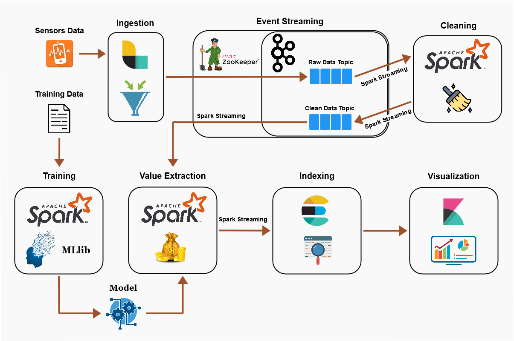
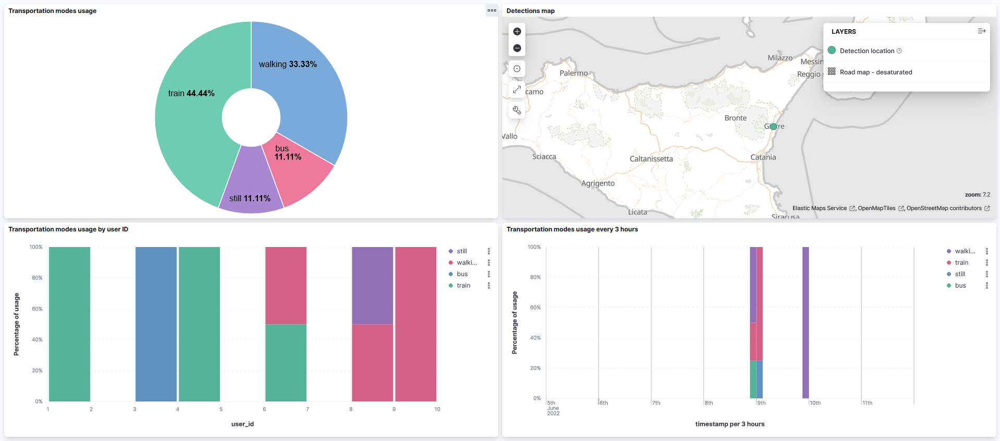

<h1 align="center">TMDA (Transportation Mode Detector and Analyzer)</h1>
<p>Real-time transportation mode detector and analyzer trained on 5 classes (bus, car, train, still, walking) to recognize human activity, based solely on two sensors coming from the user's smartphone: <b>accelerometer</b> and <b>gyroscope</b>.<br><br>
Prediction accuracy using this detector is about <b>72%</b>, meaning that 7.2 out of 10 times it will detect the correct transportation mode. </p>

# 🚀 Quickstart
```shell
$ git clone https://github.com/Alessandrus00/TMDA.git
$ cd TMDA
$ wget -P ./spark/setup https://dlcdn.apache.org/spark/spark-3.2.1/spark-3.2.1-bin-hadoop3.2.tgz
$ docker-compose up -d
```

# 📊 Workflow 

<p align="center">
  
</p>

# ⚙️ How does it work?
1. A container named **spark-training** trains a **Gradient-Boosted Tree** classification model, starting from data inside the path `/dataset/training/sensors_training_clean.csv`, which is a smaller version of `/dataset/training/dataset_5secondWindow.csv`, that can be downloaded [here](http://cs.unibo.it/projects/us-tm2017/download.html). This model is then saved to `spark/model`.

2. At the same time, a container named **zip-extractor** waits for zip files containing sensors data, generated by the mobile application [phyphox](https://phyphox.org/), to be added to `/dataset/zips`. Next it extracts and appends raw data to `dataset/sensors.csv` (if this dataset doesn't exist, it will be created).

3. A stream processing cluster is build up from **broker** (Kafka broker) and **zookeeper** containers, with an additional one, **init-kafka**, that creates two Kafka topics: **sensors-raw** (for raw data) and **sensors** (for clean data).

4. When `sensors.csv` contains new entries, a container named **logstash**, running the data ingestor Logstash, reads those entries and writes them to sensors-raw topic.

5. Once data are stored inside sensors-raw topic, a container running Spark, named **spark-cleaning** and subscribed to the above topic, is responsible for reading, cleaning and writing the results to sensors topic.
Cleaning mainly consists in: 
    + grouping data by user ID and session window (so that each user has a window started and ended by events themselves)
    + aggregating sensors data, in order to extract **mean**, **min**, **max** and **stddev** (standard deviation) for each sensor (excluding the ones that produce geo data).

6. Another container running Spark and called **spark-streaming** reads from sensors topic and predicts the transportation mode using the previously created model. Resulting dataframe is then sent to the data indexer Elasticsearch.

7. Elasticsearch is run into a dedicated container called **elasticsearch** that provides a fast way to search and query data.

8. Finally, a container named **kibana**, running the data visualization tool Kibana, provides an elegant dashboard, where data coming from Elasticsearch are represented through awsome charts. Remember to import `kibana/saved objects/kibana_objects.ndjson` to Kibana using the **import** button in the section **Stack Management > Saved Objects**.

# 📈 Dashboard

<p align="center">
  
</p>

# 👁 Peeking
| Container     | URL                                             | Description                           |
| ------------- | ----------------------------------------------- | ------------------------------------- |
| broker   | http://localhost:8080                           | Kafka UI |
| elasticsearch | http://localhost:9200/                          | ElasticSearch | base URL                |
| elasticsearch | http://localhost:9200/sensors/_search | ElasticSearch index content           |
| kibana        | http://localhost:5601                           | Kibana |

# Inspired by
http://cs.unibo.it/projects/us-tm2017/index.html

# 🤵 Author
[Alessandro Resta](https://github.com/Alessandrus00)
